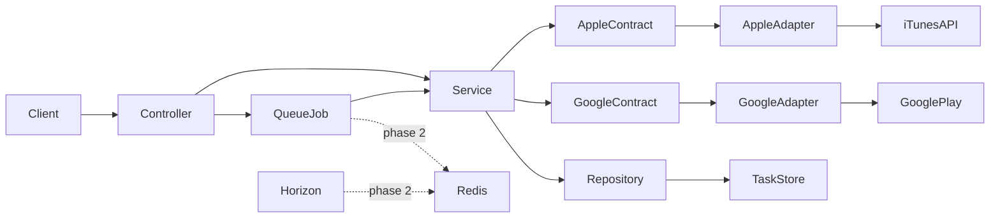

# App Icon Fetcher — Implementation Plan

Based on: [architecture-plan.md](architecture-plan.md)

Current state: Laravel 12 + Docker, `nwidart/laravel-modules` installed, API routing `/api`, modules `AppIcon` / `AppleStore` / `GooglePlay`, adapter contracts done.

## Principles

- **TDD:** write a failing test first (red), then minimal implementation (green), then refactor
- **API versioning:** all endpoints under prefix `/api/v1`
- **Two phases:** fully sync first, then migrate to Redis queues
- **Job-ready design:** all business logic lives in the service; controller and job are thin wrappers
- **Layers:** Controller → Service → Repository (controller must not call repository)

### Layers (module `AppIcon`)

```
Controller  →  Service  →  Repository
                 ↓
            Contracts (Apple / Google)
```

| Layer          | Responsibility                                                 |
| -------------- | -------------------------------------------------------------- |
| **Controller** | HTTP: FormRequest, service call, API Resource                  |
| **Service**    | Business logic: create task, fetch icons, update status/result |
| **Repository** | CRUD for `app_icon_tasks` (called only from service)           |

Ports and adapters (hexagonal): Service depends on Contracts; adapters live in `AppleStore`/`GooglePlay`.

### Naming

| Entity          | Class                     |
| --------------- | ------------------------- |
| Controller      | `AppIconTaskController`   |
| Service         | `AppIconTaskService`      |
| Repository      | `AppIconTaskRepository`   |
| Model           | `AppIconTask`             |
| Job             | `ProcessAppIconTaskJob`   |
| FormRequest     | `StoreAppIconTaskRequest` |
| Resource        | `AppIconTaskResource`     |
| Status enum     | `AppIconTaskStatus`       |
| Apple contract  | `AppleIconProvider`       |
| Google contract | `GooglePlayIconProvider`  |
| Apple adapter   | `AppleStoreIconAdapter`   |
| Google adapter  | `GooglePlayIconAdapter`   |

API fields (per task spec): `bundle_id`, `apple_icon_url`, `google_icon_url`, `errors`.

### Folder structure

```
AppIcon/
  Http/Controllers/AppIconTaskController.php
  Http/Requests/StoreAppIconTaskRequest.php
  Http/Resources/AppIconTaskResource.php
  Services/AppIconTaskService.php
  Repositories/AppIconTaskRepository.php
  Models/AppIconTask.php
  Enums/AppIconTaskStatus.php
  Jobs/ProcessAppIconTaskJob.php
  Contracts/AppleIconProvider.php
  Contracts/GooglePlayIconProvider.php
```

### Job-ready design

```php
// Controller (phase 1) — service only
$task = $this->service->createAndFetch($bundleId);

// Job (phase 1b / phase 2) — delegates to execute()
public function handle(AppIconTaskService $service): void
{
    $service->execute($this->taskId);
}
```

**Rules:**

- `createAndFetch()` — creates task via repository, calls `execute()`, returns task
- `execute($taskId)` — fetch icons, update status/result
- Controller → service only, never repository
- Job → `execute()` only

**Phase 1 order:**

1. Controller calls `service->createAndFetch()` (sync, result in POST response)
2. Wrap in `ProcessAppIconTaskJob` (still sync)
3. Phase 2: `QUEUE_CONNECTION=redis`, POST → `202`, polling via GET

## Phases

| Phase        | Queue   | POST response                     | Docker               |
| ------------ | ------- | --------------------------------- | -------------------- |
| 1 — Sync MVP | `sync`  | `200`, `status: completed` + urls | `app` + `nginx`      |
| 2 — Async    | `redis` | `202`, `status: pending`          | + `redis`, `horizon` |

Tests (`phpunit.xml`) always use `QUEUE_CONNECTION=sync`.

## Target architecture



## API (all under `/api/v1`)

| Method | Path                           | Phase 1 (sync)          | Phase 2 (async)      |
| ------ | ------------------------------ | ----------------------- | -------------------- |
| POST   | `/api/v1/app-icons/tasks`      | `200`, completed + urls | `202`, pending       |
| GET    | `/api/v1/app-icons/tasks/{id}` | `200`, completed + urls | `200`, status + urls |

Routing: `bootstrap/app.php` → prefix `/api`, module `AppIcon` → prefix `/v1`.

## MVP decisions

- **Task storage:** SQLite, table `app_icon_tasks`
- **Status enum:** `pending`, `processing`, `completed`, `failed`
- **Frontend:** none, JSON API only
- **Apple:** iTunes Lookup API
- **Google Play:** HTTP fetch + HTML parsing
- **bundle_id validation:** `^[a-zA-Z][a-zA-Z0-9_]*(\.[a-zA-Z][a-zA-Z0-9_]*)+$`

---

## Phase 1 — Sync MVP (TDD)

### 0. Bootstrap — done

- [x] Install `nwidart/laravel-modules`
- [x] Register API routing: prefix `/api`
- [x] Generate modules: `AppIcon`, `AppleStore`, `GooglePlay`
- [x] Create `app/Shared/` (DTO, Exceptions)

---

### 1. Adapter contract tests → contracts & adapters — done

**Tests (red):**

- [x] `AppleIconProvider` resolves to `AppleStoreIconAdapter`
- [x] `GooglePlayIconProvider` resolves to `GooglePlayIconAdapter`

**Implementation (green):**

- [x] Contracts in `AppIcon/Contracts/`
- [x] Adapters in `AppleStore`, `GooglePlay`
- [x] DI bindings in each store module ServiceProvider

---

### 2. Unit tests → service

**Tests (red):**

- `AppIconTaskService::execute()`: both stores return url → full result
- `execute()`: one store not found → partial + errors
- `execute()`: both failed → completed with errors, no exception

**Implementation (green):**

- `AppIconTaskService`, `AppIconTaskRepository` (interface for mocks in tests)
- DTO: `StoreIconResult`, `AppIconTaskResult` in `app/Shared/DTO/`
- Service depends on repository (mock) and contracts (mock)

> Migration and Eloquent model — in step 4a. Here repository is interface + in-memory/mock.

---

### 3. Integration tests → store adapters

**Tests (red) with `Http::fake` + fixtures in `tests/Fixtures/`:**

- `AppleStoreIconAdapter`: fixture JSON → icon url
- `AppleStoreIconAdapter`: empty results → error
- `GooglePlayIconAdapter`: fixture HTML → icon url
- `GooglePlayIconAdapter`: 404 / timeout → error

**Implementation (green):**

- Apple: iTunes Lookup, `artworkUrl512`
- Google: Play Store HTML, og:image
- Timeout 3s, graceful error mapping

---

### 4a. Feature tests → task API (sync, direct service call)

**Tests (red):**

- `POST /api/v1/app-icons/tasks` valid `bundle_id` → `200`, `status: completed`, urls
- `POST` invalid `bundle_id` → `422`
- `GET /api/v1/app-icons/tasks/{id}` → `200`, completed, urls
- `GET` partial success → completed, one url + errors
- `GET` unknown id → `404`

**Implementation (green):**

- Migration `app_icon_tasks`, model `AppIconTask`, enum `AppIconTaskStatus`
- `AppIconTaskRepository` (Eloquent)
- `AppIconTaskController` → `service->createAndFetch($bundleId)`
- `StoreAppIconTaskRequest`, `AppIconTaskResource`

**Flow (sync, no job):**

1. POST → controller → `service->createAndFetch()` → `completed` → `200` with urls
2. GET → controller → `service->find($id)` → result

---

### 4b. Wrap in job (still sync)

**Tests (red):**

- Feature tests stay green (sync job runs inline)
- `ProcessAppIconTaskJob` delegates to `AppIconTaskService::execute()`

**Implementation (green):**

- Controller: `create task` + `dispatch(ProcessAppIconTaskJob)` instead of `createAndFetch()`
- Or `createAndFetch()` dispatches internally — service API unchanged for job path
- `QUEUE_CONNECTION=sync`

---

### 5. Docker & README

- `docker compose up` + `migrate` + `test` — all green
- README: curl examples (success, partial, invalid), time spent
- `.env`: `QUEUE_CONNECTION=sync`

---

## Phase 2 — Redis queues

### 6. Migrate to Redis + Horizon

**Tests:**

- Existing tests stay green (`sync` in phpunit.xml)
- Feature test: job pushed to redis queue (`Queue::fake`)

**Docker:**

- `redis` (Redis 7)
- `horizon` — worker + UI at `/horizon`
- `redis` extension in `app/docker/Dockerfile`

**Config:**

- `.env`: `QUEUE_CONNECTION=redis`, `REDIS_HOST=redis`
- `laravel/horizon`, supervisors for `ProcessAppIconTaskJob`

**Behavior (async):**

1. POST → task `pending` → dispatch job → `202`
2. Horizon → `ProcessAppIconTaskJob` → `service->execute()` → `completed`
3. GET → poll `pending`/`processing` → result

> Service and job body unchanged. Only queue driver and POST response change.

---

## Commit order (TDD)

**Phase 1:**

1. [x] `add modules scaffold and api v1 routing`
2. [x] `add adapter contract tests and provider bindings`
3. [ ] `add AppIconTaskService unit tests and implementation`
4. `add store adapter integration tests and implementation`
5. `add task api feature tests with sync service call`
6. `wrap fetch in ProcessAppIconTaskJob delegating to service`
7. `update readme with launch instructions`

**Phase 2:** 8. `add redis and horizon to docker compose` 9. `switch queue to redis and add horizon config`
